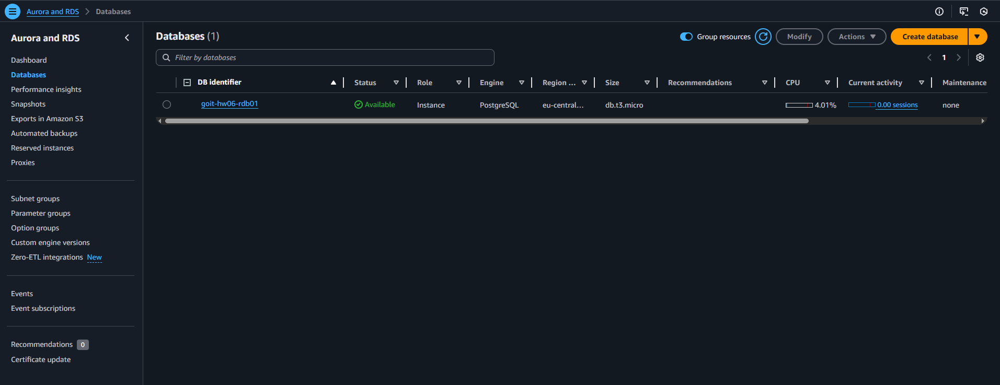
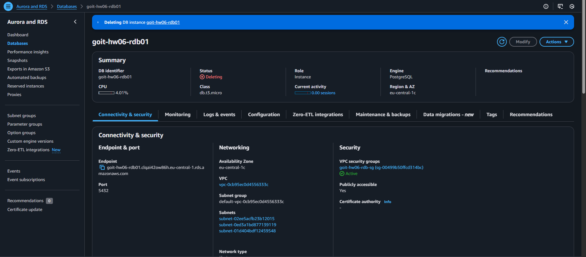

# goit-cloud-hw-06

1. Створення RDS-інстансу

Відкрити Amazon RDS → Databases/



2. Налаштування підключення (Endpoint)

Відкрити створений інстанс у RDS → Databases → Details.


3. Підключення до бази через psql

Виконати команду psql -h <endpoint> -U postgres -d postgres


4. Створення таблиці users:

Виконати SQL-запит

```
CREATE TABLE users (
    id SERIAL PRIMARY KEY,
    name VARCHAR(100),
    email VARCHAR(100) UNIQUE
);
```

5. Додавання запису у таблицю

Виконати SQL-запит

```
INSERT INTO users (name, email) VALUES ('Іван', 'ivan@example.com');

```

6. Перевірка даних у таблиці

`SELECT * FROM users;`


7. Видалення RDS-інстансу (за потреби)

Відкрити Amazon RDS → Databases → Delete.


